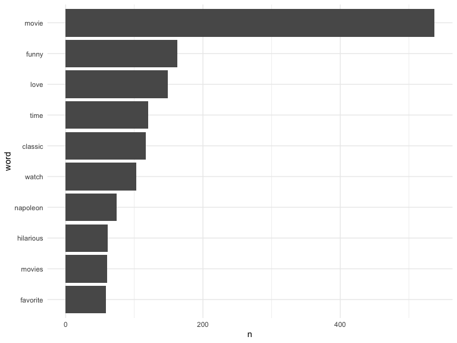
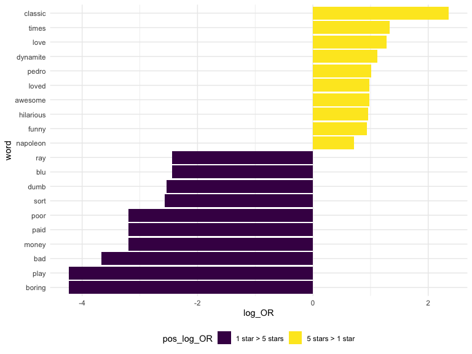

p8105\_Tidy Text
================

## Get Data

``` r
read_page_reviews <- function(url) {
  
  html = read_html(url)
  
  review_titles = 
    html %>%
    html_nodes(".a-text-bold span") %>%
    html_text()
  
  review_stars = 
    html %>%
    html_nodes("#cm_cr-review_list .review-rating") %>%
    html_text() %>%
    str_extract("^\\d") %>%
    as.numeric()
  
  review_text = 
    html %>%
    html_nodes(".review-text-content span") %>%
    html_text() %>% 
    str_replace_all("\n", "") %>% 
    str_trim()
  
  tibble(
    title = review_titles,
    stars = review_stars,
    text = review_text
  )
}

url_base = "https://www.amazon.com/product-reviews/B00005JNBQ/ref=cm_cr_arp_d_viewopt_rvwer?ie=UTF8&reviewerType=avp_only_reviews&sortBy=recent&pageNumber="

dynamite_reviews = 
  tibble(
    page = 1:100,
    urls = str_c(url_base, page)) %>% 
  mutate(reviews = map(urls, read_page_reviews)) %>% 
  unnest(reviews) %>%
  mutate(review_num = row_number()) %>% 
  relocate(page, review_num)
```

## Do some tidy text stuff

``` r
dynamite_words =
    dynamite_reviews %>% 
    unnest_tokens(word, text) %>% 
    select(-urls)
```

remove boring words

``` r
dynamite_words =
    anti_join(dynamite_words, stop_words)
```

    ## Joining, by = "word"

Usual Tidyverse stuff…

``` r
dynamite_words %>% 
    count(word, sort = TRUE) %>% 
    top_n(10) %>% 
    mutate(word = fct_reorder(word, n)) %>% 
    ggplot(aes(x = word, y = n)) +
    geom_bar(stat = "identity") +
    coord_flip()
```

    ## Selecting by n



## Compare across groups

Groups I want to compare are 1 star ad 5 star reviews.

Let’s count words in group.

``` r
dynamite_words %>% 
    filter(stars %in% c(1, 5)) %>% 
    group_by(stars) %>% 
    count(word) %>% 
    top_n(5)
```

    ## Selecting by n

    ## # A tibble: 11 x 3
    ## # Groups:   stars [2]
    ##    stars word        n
    ##    <dbl> <chr>   <int>
    ##  1     1 bad         7
    ##  2     1 dumb        8
    ##  3     1 dvd         7
    ##  4     1 movie      50
    ##  5     1 time        9
    ##  6     1 watch       8
    ##  7     5 classic   102
    ##  8     5 funny     124
    ##  9     5 love      139
    ## 10     5 movie     429
    ## 11     5 time       99

``` r
dynamite_words %>% 
    filter(stars %in% c(1, 5)) %>% 
    group_by(stars) %>% 
    summarise(n = n())
```

    ## `summarise()` ungrouping output (override with `.groups` argument)

    ## # A tibble: 2 x 2
    ##   stars     n
    ##   <dbl> <int>
    ## 1     1   648
    ## 2     5  4477

We now need an “odds ratio”

``` r
word_ratios = 
    dynamite_words %>% 
    filter(stars %in% c(1, 5)) %>% 
    count(word, stars) %>% 
    group_by(word) %>% 
    filter(sum(n) >= 5) %>% 
    ungroup(word) %>% 
    pivot_wider(
        names_from = stars, 
        values_from = n,
        names_prefix = "stars_", 
        values_fill = 0
    ) %>% 
    mutate(
        stars_1_odds = (stars_1 + 1) / (sum(stars_1) + 1), 
        stars_5_odds = (stars_5 + 1) / (sum(stars_5) + 1), 
        log_OR = log(stars_5_odds / stars_1_odds)
    )
```

Can we do something useful with this?

``` r
word_ratios %>% 
    mutate(pos_log_OR = ifelse(log_OR > 0, "5 stars > 1 star", 
                               "1 star > 5 stars")) %>% 
    group_by(pos_log_OR) %>% 
    top_n(10, abs(log_OR)) %>% 
    ungroup() %>% 
    mutate(word = fct_reorder(word, log_OR)) %>% 
    ggplot(aes(x = word, y = log_OR, fill = pos_log_OR)) +
    geom_bar(stat = "identity") + 
    coord_flip()
```


